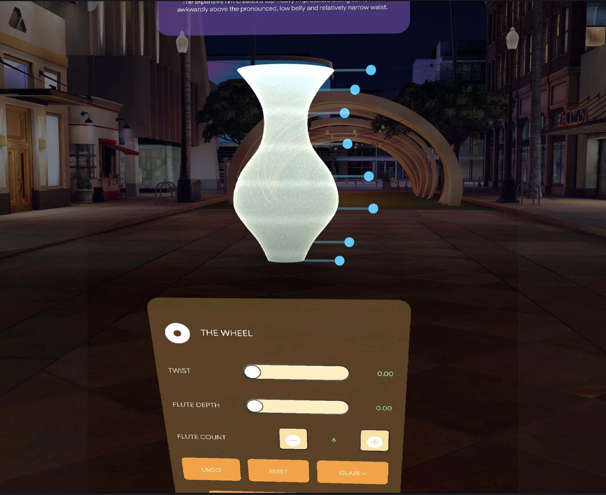
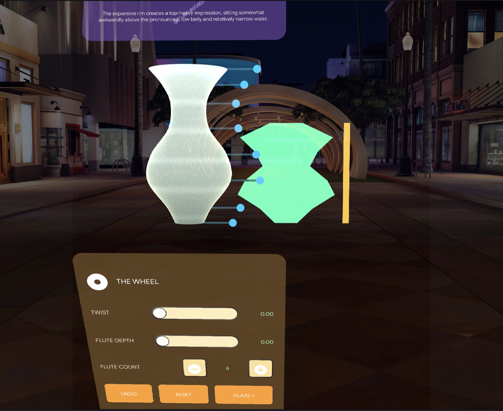
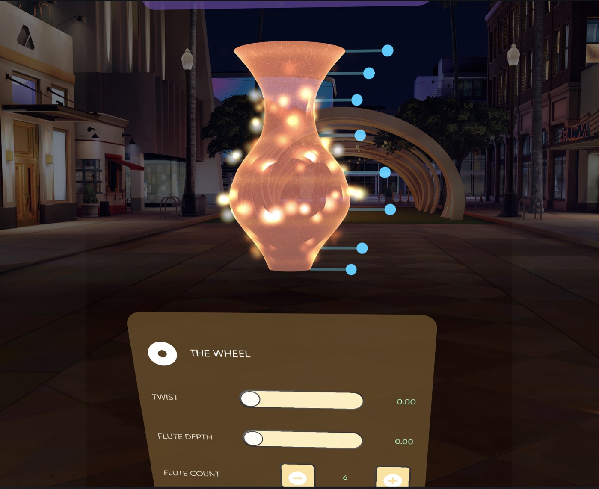

# WHEEL

A spatial ceramics studio for Snap Spectacles: throw a pot with your voice, shape it with your hands, glaze it by describing it out loud, fire it, and carry it out as a QR code that opens the finished vessel in any browser.

**[▶ Watch the demo video](https://drive.google.com/file/d/1urlJZoVyDap54IbvJ_SZaNndd7McSsNT/view?usp=sharing)**

**Companion decoder:** <https://havalz.github.io/kiln-and-wheel/> — scan a pot's QR, or open the link, to view and export the piece as STL or OBJ. No account, no server, no database.

---

## The loop

| | |
|---|---|
| **Throw** | Hold and hum. The microphone's amplitude envelope becomes the silhouette — loud is wide, quiet is narrow — drawn live beside the wheel as you sing it. |
| **Shape** | Eight control handles float clear of the form. Pinch and pull; the lathe re-meshes every frame. |
| **Glaze** | Hold the mic and describe a glaze. Gemini returns real material parameters; six local presets take over if it can't. |
| **Fire** | A six-second firing seeded from the piece itself. The same pot always fires the same way. |
| **Take it home** | The vessel is packed into 35 bytes, rendered as a QR code on the bench, and opens in the browser as a 3D model you can export. |

---

## Screenshots

| | |
|---|---|
|  | **Shaping.** Eight control handles float clear of the form as offset grips, each with a leader line back to the point on the profile it moves. |
|  | **Throwing with voice.** The amplitude envelope is drawn live as the vessel's own profile — loud is wide, quiet is narrow — with the amber track counting down the four-second take. |
|  | **Firing.** The glaze darkens to ember as heat rings climb the silhouette and a bloom pools at the foot, all driven by one shared 0–1 heat curve. |

---

## How it works

**Runtime lathe, allocate-once.** Every vessel is generated at runtime — there are no authored meshes. Eight control points are Catmull-Rom resampled to 48 profile samples and revolved through `MeshBuilder`. Vertex and index buffers are appended exactly once per LOD; an edit rewrites vertex data in place and calls `updateMesh()`. Two LODs swap on drag state: 48 radial segments at rest, 16 while a handle is moving, so dragging stays responsive without giving up a smooth silhouette when you let go.

**Glaze as a Shader Graph.** The glaze is a custom graph, not a texture: a two-point vertical gradient with a rim tint, a crackle network, and drips that pool by gravity — the drip term is driven by the surface normal's vertical component, so glaze gathers where a real glaze would. Because the Spectacles waveguide renders black as transparent, the graph clamps every colour channel to a floor; the model is instructed to express a "black" glaze as a bright desaturated warm brown rather than something that would simply vanish on the glasses.

**Seeded, reproducible firing.** Firing is a deterministic transform, not a random one. A mulberry32 PRNG seeded by an FNV-1a hash of the piece's own geometry drives the hue shift, crackle change, drip change and bloom placement, so a given pot fires identically every time — and the seed travels in the QR payload, which is what lets the browser reproduce the fired piece exactly.

**35-byte profile codec.** A whole vessel — 8 control points, twist, flute count and depth, height, two glaze colours, roughness, metallic, crackle, drip, and the 32-bit firing seed — packs into 35 bytes, encoded as 47 characters of base64url. Verified by a 300-piece round-trip with zero delta beyond quantisation.

**Self-contained QR encoder.** No QR library. Byte mode, ECC level L, Version 5 with automatic step-up, written from the spec and rendered into a `ProceduralTexture` on the bench. Verified against an independent decoder (Apple CoreImage). A text URL is always shown as a fallback, because a QR that fails to scan should never be a dead end.

**Stateless decoder page.** `docs/index.html` is one static file: it reads the payload from the URL fragment, rebuilds the same Catmull-Rom curve and the same twist and flute formulas the Lens uses, and renders it with three.js `LatheGeometry` — then exports STL or OBJ in-browser. The fragment never leaves the device. A service worker caches the page and its modules so it works offline after first load.

---

## Built with CLAD

| Skill / agent | What it did |
|---|---|
| `lens-studio-router` | Entry point and routing for every phase. |
| `mesh-builder-scripting` | The runtime lathe: allocate-once buffers, dual LOD, the `updateMesh()` contract. |
| `shader-graph` | The glaze graph — gradient, crackle, gravity-pooled drips, waveguide-safe floor. |
| `materials` | Material assets, additive blend modes, the `ENABLE_BASE_TEX` define. |
| `vfx-graph` | Kiln ember VFX. Ultimately **replaced** by MeshBuilder sprite swarms — the VFX particle pass never survived into a preview capture, so it could not be verified. |
| `build-sfx` | Wheel hum, the three pitched ceramic bells for the ping test, kiln roar, cooling ticks, reveal chime. |
| `specs-asr` | Spoken glaze capture on the glaze bench. |
| `specs-ai-remote-service` | Gemini glaze generation via Remote Service Gateway, with a 20-second timeout and local fallback. |
| `specs-audio` | Playback modes and concurrent-source budget. |
| `specs-build-ui` | The four station panels — wheel, glaze bench, kiln, shelf — in UIKit flex layouts. |
| `specs-world-query` | Surface placement for setting a fired pot down in the room. |
| `specs-depth` | Investigated for occlusion; ruled out in Preview. |
| `live-lens-tester` / `specs-leaf-*` | The LEAF scenario suite below. |
| `perfetto-trace-analysis` / `specs-capture-perf-trace` | The performance loop — capture, attribute, decide. |
| `script-author` | Parallel authoring of the export bridge (codec, QR encoder, QR texture). |

---

## Verification

**LEAF scenarios — 6/6 passing** in Lens Studio Preview:

| Scenario | Asserts |
|---|---|
| `wheel-shaping` | A simulated pinch-drag moves the real vertex buffer — 7206 floats read back off the `RenderMesh`, not inferred from the model. |
| `wheel-glaze-fallback` | A failed Gemini call lands on a local preset rather than stalling. |
| `wheel-firing` | Firing transforms the glaze and reveals deterministically. |
| `wheel-persistence` | A saved piece survives a reload from `PersistentStorage`. |
| `wheel-ping-test` | Tapping a fired pot rings it and leaves position, rotation and scale **byte-identical**; a placement drag lands clear of all four panels. |
| `wheel-all-handles` | All 8 handles move the mesh **on a deliberately widened silhouette**, the shape that used to break the lower three. |

**Performance** (Perfetto capture, Spectacles profile, 618-frame window):

| | Measured | Budget |
|---|---|---|
| Frame time p50 | **4.34 ms** | 16.67 ms |
| Frame time p90 | 5.42 ms | 16.67 ms |
| Frame time p99 | 8.28 ms | 16.67 ms |
| Frames over budget | 4 of 618 | — |

About 26% of a 60 fps budget at p50, with p99 still inside it. WHEEL's own scripts account for **1.00 ms** of `Scene::Update`; most of the remainder is the Preview harness's face tracking, which does not ship. No optimisation was warranted.

---

## Known limitations

**Placement is untested on device.** In the "Evening Room" preview scene, `WorldQueryModule` returns no surface hit across 14 raw casts (warm and cold sessions, rays swept through the viewed region), and `Physics.Probe.rayCast` finds no furniture colliders — a 12-ray grid hits only the Lens's own `InteractionPlaneColliderRoot`, which serves as a positive control proving the probe itself works. The scene carries neither queryable depth nor colliders, so the simulator always falls back to a fixed pose 70 cm ahead. This is a property of the preview scene, not evidence that placement is broken; **device behaviour is untested either way.**

**Deferred.** Crystal glaze blooms (three sessions of investigation, narrowed to a suspected Shader Graph transpiler issue and deliberately parked) and kiln heat shimmer.

**A wet pot no longer thuds when tapped.** Its tap collider is inactive until firing, because that collider was swallowing pinches aimed at the lower profile handles. Reversible if the thud matters more.

---

## Setup

Requires **Lens Studio 5.22+** and a Spectacles-capable project target.

Packages (all from the Asset Library):

- Spectacles Interaction Kit
- Spectacles UI Kit
- Remote Service Gateway
- Leaf (for the scenario suite)
- Bitmoji 3D, Utilities, SnapDecorators

**Remote Service Gateway tokens are blanked in this repo by design.** `Assets/Scene.scene` stores `snapToken` / `openAIToken` / `googleToken` as plaintext, they are minted from a developer's own Snap login, and they expire in about an hour — so committing them would leak quota and help nobody. A pre-commit hook blocks them from re-entering history:

```sh
ln -sf ../../Tools/pre-commit-token-guard.sh .git/hooks/pre-commit
```

Regenerate them locally when you want live AI:

```
ExecuteEditorCode -> Tools/refresh-rsg-tokens.ts
```

**Without tokens the Lens still runs.** The glaze bench degrades to six offline glaze presets and piece naming falls back to a deterministic local namer, so a reviewer can clone, open, and complete the full loop — throw, shape, glaze, fire, export — with no credentials at all.

---

## Repository layout

```
Assets/Scripts/core/     pure logic — profile model, lathe mesher, codec, acoustics
Assets/Scripts/          scene glue — stations, placement, audio, UI
Assets/Scripts/export/   35-byte codec, QR encoder, QR texture
Assets/Scripts/tests/    LEAF scenarios
docs/                    the stateless decoder page (GitHub Pages)
prompt-log/              build log and performance report
Tools/                   token refresh + the pre-commit guard
```
